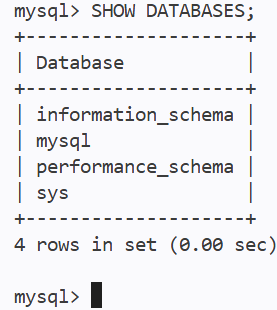

# 02 - MySQL

<table width="100%" style="border: none; border-collapse: collapse;">
  <tr style="border: none;">
    <td align="left" style="border: none;">
      <a href="01-ambiente.md">Anterior</a>
    </td>
    <td align="right" style="border: none;">
      <a href="03-projeto.md">Próximo</a>
    </td>
  </tr>
</table>

---

# Versão

1. No terminal, execute os comandos abaixo, para visualizar a versão instalada do `Node.js`, do `Node Package Manager (NPM)` e do `MySQL`:  :

```bash
node -v 
```

```bash
npm -v
```

```bash
mysql --version
```

**OBS**: no caso do `MySQL`, pode ser que seja necessário executar `mysql -V` ou executar o comando `SELECT VERSION()`; após acessar o prompt do banco de dados.

---

# Inicie o Servidor MySQL em Segundo Plano

```bash
sudo /usr/sbin/mysqld --user=mysql &
```

**OBS**: após dar Enter, algumas linhas de log vão aparecer. Aperte a tecla `<ENTER>` mais uma vez para liberar a linha de comando.

---

# Verifique o MySQL em execução:

```bash
ps -aux | grep mysql
```

# Defina a Senha do Usuário Root

1. Conecte no terminal administrativo:

```bash
sudo mysql --protocol=socket -u root -proot
```

2. Dentro do prompt `mysql>`, cole o comando abaixo e tecle `<Enter>`:

```sql
ALTER USER 'root'@'localhost' IDENTIFIED WITH caching_sha2_password BY 'root';
FLUSH PRIVILEGES;
EXIT;
```

# Entrar no Console do MySQL

1. No terminal, execute o comando abaixo:

```bash
sudo mysql -u root -proot
```

**OBS**: lembre-se de deixar o `-proot` tudo junto. Se colocar espaço entre o `-p` e o `root`, o `MySQL` vai achar que `root` é o nome de um banco de dados e vai dar erro.


# Entrar no Console do MySQL de Forma Alternativa

1. Aternativamente, você pode entrar no console interativo do MySQL executando o comando abaixo no terminal:

```bash
sudo mysql -u root -p
```

2. O terminal vai pedir a senha de forma protegida. 

3. Digite `root`.

4. tecle `<Enter>`. 

# Listar os Bancos de Dados

1. No console interativo do `MySQL`, execute o comando abaixo:

```sql
SHOW DATABASES;
```


---

<table width="100%" style="border: none; border-collapse: collapse;">
  <tr style="border: none;">
    <td align="left" style="border: none;">
      <a href="01-ambiente.md">Anterior</a>
    </td>
    <td align="right" style="border: none;">
      <a href="03-projeto.md">Próximo</a>
    </td>
  </tr>
</table>
