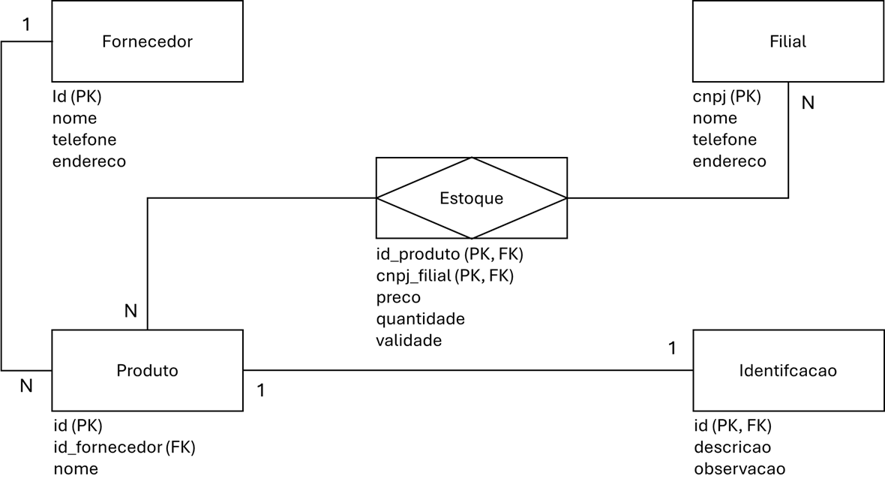

# 02 - Projeto 

<table width="100%" style="border: none; border-collapse: collapse;">
  <tr style="border: none;">
    <td align="left" style="border: none;">
      <a href="01-ambiente.md">Anterior</a>
    </td>
    <td align="right" style="border: none;">
      <a href="03-banco-de-dados.md">Próximo</a>
    </td>
  </tr>
</table>

---

Projeto de uma empresa usado nos exemplos:

---

<table width="100%" style="border: none; border-collapse: collapse;">
  <tr style="border: none;">
    <td align="left" style="border: none;">
      <a href="01-ambiente.md">Anterior</a>
    </td>
    <td align="right" style="border: none;">
      <a href="03-banco-de-dados.md">Próximo</a>
    </td>
  </tr>
</table>