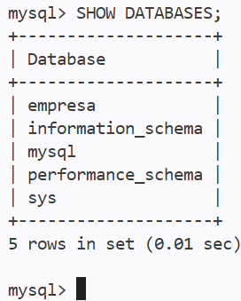

# 04 - Criação do Banco de Dados

<table>
  <tr>
    <td align="left" style="border: none;">
      <a href="03-projeto.md">Anterior</a>
    </td>
    <td align="right" style="border: none;">
      <a href="05-fornecedor.md">Próximo</a>
    </td>
  </tr>
</table>

---

# CREATE DATABASE

1. Crie o banco de dados:

```sql
-- Cria o banco de dados:
CREATE DATABASE empresa;
```

2. Alternativamente, crie o banco de dados apenas se ele ainda não existir (evita erros):

```sql
-- Cria o banco de dados apenas se ele ainda não existir (evita erros)
CREATE DATABASE IF NOT EXISTS empresa;
```

---

# Listar os Bancos de Dados

1. No console interativo do `MySQL`, execute o comando abaixo:

```sql
SHOW DATABASES;
```



---

# Selecionar um Banco de Dados

1. Selecione (use) o banco de dados `empresa` para os próximos comandos:

```sql
-- Seleciona o banco de dados para os próximos comandos:
USE empresa;
```

---


## Configurando a Extensão "Database Client"

1. Na barra lateral esquerda do `VS Code`, clique no ícone de **Banco de Dados** (tomada/cilindros).

2. Clique no botão **`+`** (Create Connection).

3. Escolha o tipo de banco: **MySQL**.

4. Preencha os campos exatamente assim:
   - **Host:** `localhost`
   - **Username:** `root`
   - **Password:** `root`
   - **Database:** `empresa` *(ou deixe em branco)*

5. Clique no botão **Connect**.

---

<table>
  <tr>
    <td align="left" style="border: none;">
      <a href="03-projeto.md">Anterior</a>
    </td>
    <td align="right" style="border: none;">
      <a href="05-fornecedor.md">Próximo</a>
    </td>
  </tr>
</table>
